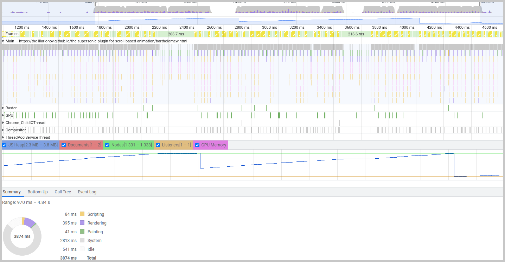
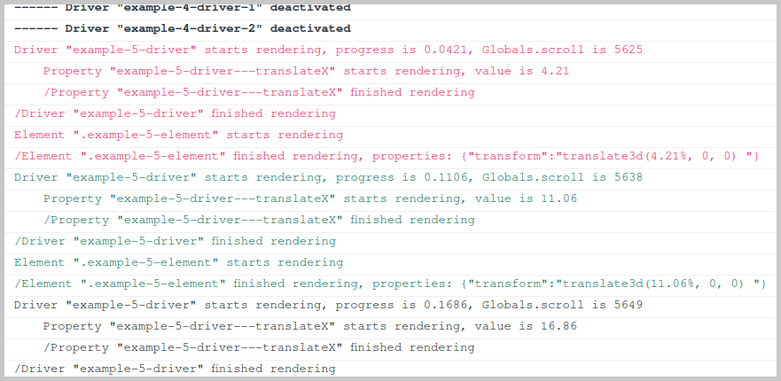

# The Supersonic Plugin For Scroll Based Animation


- [Main features](#main-features)
- [Installation](#installation)
- [Examples](#examples)
- [Configuration](#configuration)
- [Tips and advices](#tips-and-advices)

---

Once upon a time, I suddenly realized that I need to animate 1000 pictures of my cat Bartholomew with scrolling. Moreover, it had to work on mobiles as is, without any additional rules. And work fast without killing the browser. And be highly customizable to fit any needs.

Other solutions did not go well, so I decided to write my own (of course, I did).

[Go check the final result and see how 1000 Bartholomews are animated!](https://the-illarionov.github.io/the-supersonic-plugin-for-scroll-based-animation/bartholomew.html)

# Main features

1. ## 3.2kb gzipped (10kb minified)
    - 0 dependencies
    - 100% TypeScript
    - ESM and IIFE formats, both minified and uncompressed

2. ## Adaptiveness out-of-the-box

    Instead of manually setting the start and end values of the scroll, you use HTML elements (**_drivers_**).

    Their appearance will control the animation. The Plugin uses the driver's top offset as a value ([check live example](https://the-illarionov.github.io/the-supersonic-plugin-for-scroll-based-animation/#basic)).

    That's why you can forget about adaptiveness, because you have already done your work to proper layout for mobiles!

3. ## Customization and crazy flexibility
    ### Each driver can animate multiple properties, each of which can be applied to multiple elements
    Orchestrating supercomplex animations is so dead simple now! It's up to you to decide, be it one driver to rule them all or an army of drivers for each particular element ([check live example](https://the-illarionov.github.io/the-supersonic-plugin-for-scroll-based-animation/#multiple-drivers)).

    ### Different animations for different screens
    You can easily define different sets and you are not limited by mobile queries only - you can use **any** valid media query ([check live example](https://the-illarionov.github.io/the-supersonic-plugin-for-scroll-based-animation/#media-queries))!

    ### Hooks for each step. Hooks for the win!
    Almost every internal stuff has a hook, so it gives you a clean and simple way to add some custom logic ([check live example](https://the-illarionov.github.io/the-supersonic-plugin-for-scroll-based-animation/#custom-transition)).

    A list of all hooks is described in [configuration](#configuration) section.
    ### Easy to understand and customize sources
    All of the sources were written to be clear and simple to understand so you could fork it and tweak it "low-level" pretty easily. Use TypeScript and get all of the type support!
    ```javascript
    // src/engine/Driver.ts
    /**
     * The main purpose of Driver is to calculate current progress from 0 to 1 depending on current scroll and 'start' and 'end' elements top offset in document
    */
    export class Driver {
        id: string
        /** Progress is generated by script and means how much of the scroll covered right now. Minimum value: 0, maximum value: 1, float number with 4 numbers after decimal point precision */
        progress = 0
        /** Only active drivers are rendered. Driver becomes active when it's HTML elements become visible */
        active = false
        ...
    ```

4. ## Speed

    The Plugin uses IntersectionObserver, so only visible elements will be processed. It means you can have lots of elements!

    Also, there are small tricks for tiny optimizations.

    For example, float number rounding after the decimal point is used heavily, and instead of ```parseFloat(float.toFixed(2))``` The Plugin uses bitwise rounding:
    ```javascript
    function supersonicToFixed(number: number, precision: number) {
        precision = 10 ** precision
        return ~~(number * precision) / precision
    }
    ```
    It is 90% more performant.

    As a result, [1000 Bartholomews](https://the-illarionov.github.io/the-supersonic-plugin-for-scroll-based-animation/bartholomew.html) performs like this on 10 years old PC (i7-4770, 8Gb RAM):

    

    Yeah, it lags a little, but check the Heap size and total Scripting time!

  The Plugin itself still works extremely fast, it takes about ***0.5ms*** per frame to make all of the calculations, the rest is rendering.

     It is one goddamn thousand HTML elements animating over here!

5. ## Bonuses

- Suits well for SPA frameworks thanks to ```uninit()```, which cleans all the stuff (instances, events listeners, etc.);

- Keeps all transformations after you scroll and reload a page (even if you have multiple drivers animating the same property);

- Keeps your CSS "translate" properties. For example, if you have ```transform: translateX(10px)``` defined in your CSS and want to animate ```translateY```, it will keep translateX as is.

- In the development mode, you can see the internal logic:

    

    Different colors mean different frames. You can disable logs by setting ```src/singletons/Globals/devGlobals.showConsole: false```.

And all of this at a price of 3.2Kb!

So what are you waiting for?

# Installation

## NPM

```
npm install the-supersonic-plugin-for-scroll-based-animation --save-dev
```

```javascript
import TheSupersonicPluginForScrollBasedAnimation from "the-supersonic-plugin-for-scroll-based-animation"

new TheSupersonicPluginForScrollBasedAnimation({
    // ...configuration
})
```

## CDN
### IIFE Minified
```html
<script src="https://unpkg.com/the-supersonic-plugin-for-scroll-based-animation"></script>

<script>
  new TheSupersonicPluginForScrollBasedAnimation({
    // ...configuration
  })
</script>
```
### IIFE Uncompressed
```html
<script src="https://unpkg.com/the-supersonic-plugin-for-scroll-based-animation/lib/the-supersonic-plugin-for-scroll-based-animation.iife.js"></script>

<script>
  new TheSupersonicPluginForScrollBasedAnimation({
    // ...configuration
  })
</script>
```
### ESM Minified
```html
<script type="module">
  import TheSupersonicPluginForScrollBasedAnimation from 'https://unpkg.com/the-supersonic-plugin-for-scroll-based-animation/lib/the-supersonic-plugin-for-scroll-based-animation.min.js'

  new TheSupersonicPluginForScrollBasedAnimation({
    // ...configuration
  })
</script>
```
### ESM Uncompressed
```html
<script type="module">
  import TheSupersonicPluginForScrollBasedAnimation from 'https://unpkg.com/the-supersonic-plugin-for-scroll-based-animation/lib/the-supersonic-plugin-for-scroll-based-animation.js'

  new TheSupersonicPluginForScrollBasedAnimation({
    // ...configuration
  })
</script>
```

# Examples

Go check [live examples](https://the-illarionov.github.io/the-supersonic-plugin-for-scroll-based-animation/) with source codes.

# Configuration
Here is the full list of all possible options:
```javascript
new TheSupersonicPluginForScrollBasedAnimation({
    drivers: {
        "your-driver-id": { // value of [data-supersonic-driver]
            properties: {
                translateX: { // any valid numeric CSS property
                    start: 0, // number
                    end: 100,
                    unit: "%" // optional, any string, default is ""
                    elements: [ ".animated-element" ] // array of any valid CSS selectors,
                    hooks: { // property hooks, each hook is optional
                        onInit(property) {
                            // called during instance initialization
                        },
                        onBeforeRender(property) {
                            // called after property value calculation, before applying property to elements
                        },
                        onAfterRender(property) {
                            // called after property was applied to all elements
                        },
                        onUpdateLimits(property) {
                            // called when parent driver calls updateLimits()
                        }
                    }
                },
                // ...more properties
            },
            hooks: { // driver hooks, each hook is optional
                onInit(driver) {
                    // called during instance initialization
                },
                onBeforeRender(driver) {
                    // called after driver progress calculation, before rendering properties
                },
                onAfterRender(driver) {
                    // called only if progress has changed since previous frame
                },
                onActivation(driver) {
                    // called when driver is intersected by IntersectionObserver
                },
                onDeactivation(driver) {
                    // called when driver stops intersecting by IntersectionObserver
                },
                onUpdateLimits(driver) {
                    // called when window resizes or  TheSupersonicPluginForScrollBasedAnimation calls updateLimits()
                }
            }
        },
        // ...more drivers
    },
    elements: { // optional, needed if you want to hook elements
        ".some-css-selector": { // the same value as driver.properties.elements
            hooks: { // element hooks, each hook is optional
                onInit(element) {
                // called during instance initialization
                },
                onBeforeRender(element) {
                    // called before render
                },
                onAfterRender(element) {
                    // called after render
                },
                onUpdateLimits(element, driver) {
                    // called when driver calls its updateLimits()
                },
                onAddProperty(element, property) {
                    // called after property was added, can be used to make some tunings before property will be actually applied to the element */
                },
            }
        },
        // ...more elements
    },
    options: { // optional
        observerRootMargin: "100px" // "rootMargin" property of IntersectionObserver, default is "100px"
    },
    hooks: { // global hooks, each hook is optional
        onInit(plugin) {
            // called during plugin initialization
        },
        onBeforeRender() {
            // called after current scroll (Globals.scroll) has been updated
        },
        onAfterRender() {
            // called at the end of animation frame
        },
        onUpdateLimits() {
            // called when window resizes */
        }
    }
})
```
Also, you can use programmatic start and end values ([check live example](https://the-illarionov.github.io/the-supersonic-plugin-for-scroll-based-animation/#custom-start-and-end)):
```javascript
new TheSupersonicPluginForScrollBasedAnimation({
    drivers: {
        "your-driver": {
            properties: {
                translateY: {
                    start: 0,
                    end(property) {
                        return window.innerHeight
                    },
                    unit: "px",
                    elements: [".animatable-element"],
                },
            ...
```

And moreover, you can use different sets of animations for different screens ([check live example](https://the-illarionov.github.io/the-supersonic-plugin-for-scroll-based-animation/#media-queries)):

```javascript
new TheSupersonicPluginForScrollBasedAnimation({
    drivers: {
        "your-driver": {
            properties: {
                "default": {
                    translateY: {
                        start: 0,
                        end: 100,
                        unit: "px",
                        elements: [".animatable-element"],
                    },
                },
                "(max-width: 768px)": {
                    opacity: {
                        start: 1,
                        end: 0,
                        elements: [".animatable-element"],
                    },
                }
            ...
```

The Plugin provides everything you need as static members:
```javascript
TheSupersonicPluginForScrollBasedAnimation.Driver
TheSupersonicPluginForScrollBasedAnimation.Property
TheSupersonicPluginForScrollBasedAnimation.Element
TheSupersonicPluginForScrollBasedAnimation.Globals
```

For example, if you need to manually render some driver, you use:
```javascript
TheSupersonicPluginForScrollBasedAnimation.Driver.instances.get(".my-driver").render()
```

You can check the sources, they are designed to be well-read, everything is commented.

## Tips and advices

- Yes, it's possible to animate any numeric CSS property, but be careful with properties that causes [reflow](https://developers.google.com/speed/docs/insights/browser-reflow). See [this](https://gist.github.com/paulirish/5d52fb081b3570c81e3a) list to check if your propery does it.

- If you want to make adjustments on window resize, write a driver ```onUpdateLimits()``` hook like this:
```javascript
new TheSupersonicPluginForScrollBasedAnimation({
    drivers: {
        ...
    },
    hooks: {
        onUpdateLimits() {
            // ...some cool code
        }
    }
```
Or hook specific driver only:
```javascript
new TheSupersonicPluginForScrollBasedAnimation({
    drivers: {
        "your-driver-id": {
            hooks: {
                onUpdateLimits(driver) {
                    // make some adjustments with access to Driver instance
                }
            },
        ...
```

- If you animate multiple elements identically, you can use one big selector:
```javascript
new TheSupersonicPluginForScrollBasedAnimation({
    drivers: {
        "your-driver-id": {
            properties: {
                opacity: {
                    start: 0,
                    end: 1,
                    elements: [".one-selector, .another, .and-more, .and-more"]
                },
            ...
```
This way only one instance of Element will be created, which can give you a little performance boost.

---

Cheers from Bartholomew :3
